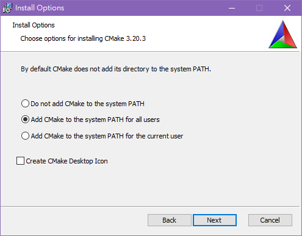
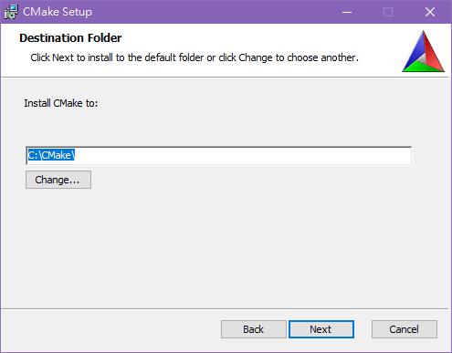
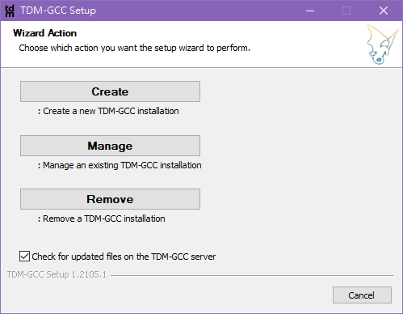
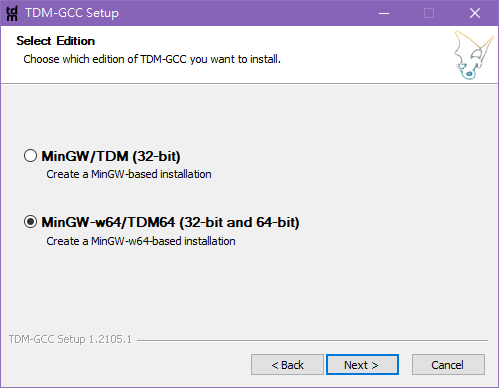
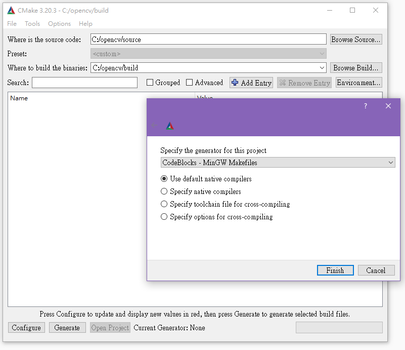
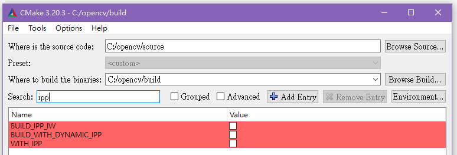
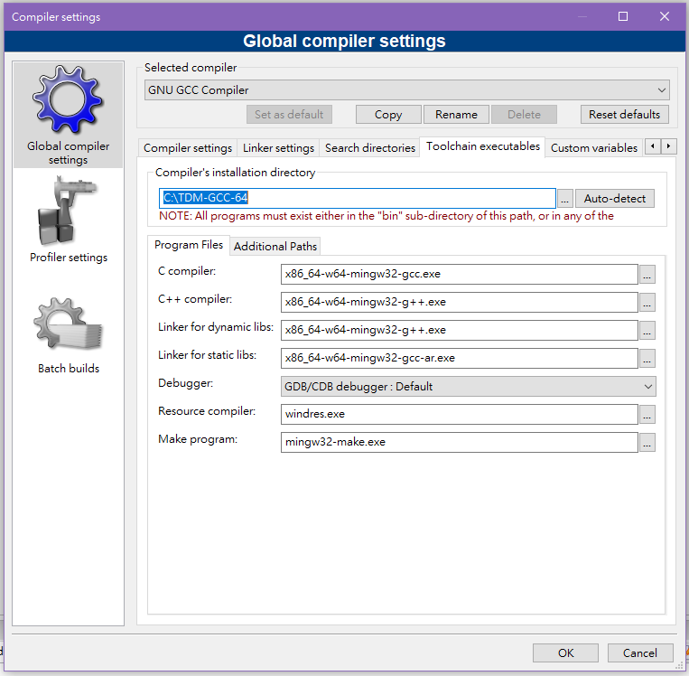
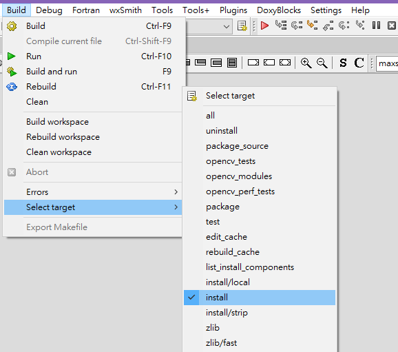
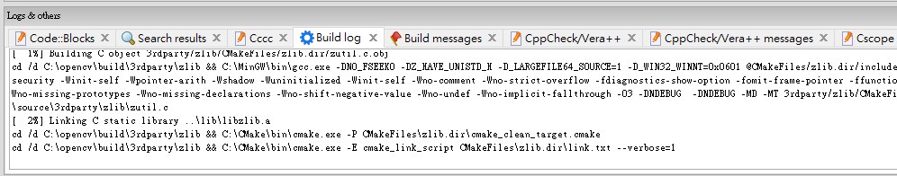
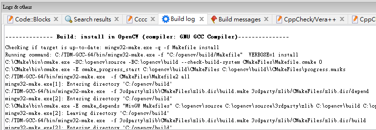

# OPENCV 安裝指南

## 1. 前言

這個方法是我在網路上找的，大多參考[這個網站](https://medium.com/@sourabhjigjinni/install-opencv-4-0-0-for-c-windows-7-10-code-blocks-tdm-gcc-64-dff65addf162)，然後把它改的詳細一點而已

如果你的電腦裡有 **MinGW 請移除**，包括孟駿提供的，之後再裝回來即可，**否則99.99%會失敗**

## 2. 需要的工具

要用到 **CodeBlock**，應該不會有人沒ㄅ

其他要用的，可來我的[Google Drive下載](https://drive.google.com/file/d/1aLryH8sqTeMiGuKjUB-BDm1s3Jm3RAgc/view?usp=sharing)，裡面東西都是從官網來的  

或者是你會怕，也可自己去官網下載：
- [CMake](https://cmake.org/download/) 選x86-64.msi
- [TDM-GCC](https://jmeubank.github.io/tdm-gcc/) 選左邊的MinGW-w64
- [OpenCV](https://opencv.org/releases/) 選任一個版本的Sources下載。創建一個新資料夾opencv，裡面創兩個空資料夾build、source，然後把剛剛下載的檔案解壓縮後丟入source

## 3. 安裝CMake

執行我給的 **cmake-3.20.3-windows-x86_64.msi**

選 **Add to system path for all user**

把安裝路徑改成 **C:\CMake**

再 **Install** 就 OK 啦！

## 4. 安裝TDM-GCC
執行 **tdm64-gcc-10.3.0-2.exe**  並 **create**

選 **MinGW-w64**

後面就都不改，照預設的安裝！

## 5. OPENCV
把我那個 **opencv** 資料夾直接拖到 C 槽底下

## 6. Binaries
執行 **C:\CMake\bin\cmake-gui.exe**

- **source** 的地方打 **C:/opencv/source**  
**binary** 的地方打 **C:/opencv/build**  

- **Grouped** 跟 **Advanced** 不用勾選  

- 按 **Configure** 再選擇 **CodeBlocks - MinGW**  
用 **Use default native compilers**

- 按下 **Finish** ，等他跑完

接下來要搜尋一些選項

要**取消勾選**的有：
- WITH_MSMF
- WITH_IPP
- WITH_TBB
- ENABLE_PRECOMPILED_HEADERS
- BUILD_PROTOBUF
- PROTOBUF_UPDATE_FILES
- WITH_PROTOBUF
- OPENCV_ENABLE_ALLOCATOR_STATS
- WITH_OPENCL_D3D11_NV

要**勾選**的：
- WITH_OPENCL
- WITH_DIRECTX

全部改好之後按 **Generate**，跑完就好了！

## 7. Build
到 **C:\opencv\build** 資料夾裡找 **OpenCV.cbp**，那是一個 CodeBlock 專案，點兩下直接開啟它，如果開不起來就先開 CodeBlock 再載入

上面 **Settings->Compiler**，找底下的 **Toolchain executables** 分頁，把 **Compiler** 路徑改成 **C:\TDM-GCC-64**
- **C compiler** 找 **C:\TDM-GCC-64\bin** 目錄的 **x86_64-w64-mingw32-gcc.exe**

- **C++ complier** 選 **x86_64-w64-mingw32-g++.exe**

- **Linker for dynamic** 選 **x86_64-w64-mingw32-g++.exe**

- **Linker for static** 選 **x86_64-w64-mingw32-gcc-ar.exe**

按OK後，不要急著按**build**按鈕，先找到上面 **Build->Select target** 選 **install**

接下來就可以按下你熟悉的 **build** 按鈕啦(或者Ctrl+F9)，在底下 **build log** 就能看到它開始跑ㄌ，左邊的中括號裡面有百分比可以看

如果出錯的話，到 **build log** 的最上面檢查一下，確保他是使用 **C:/TDM-GCC-64/bin/mingw32-make.exe** 編譯，如果他是使用 **C:/MinGW** 之類的，那就代表你舊的MinGW沒有刪乾淨

